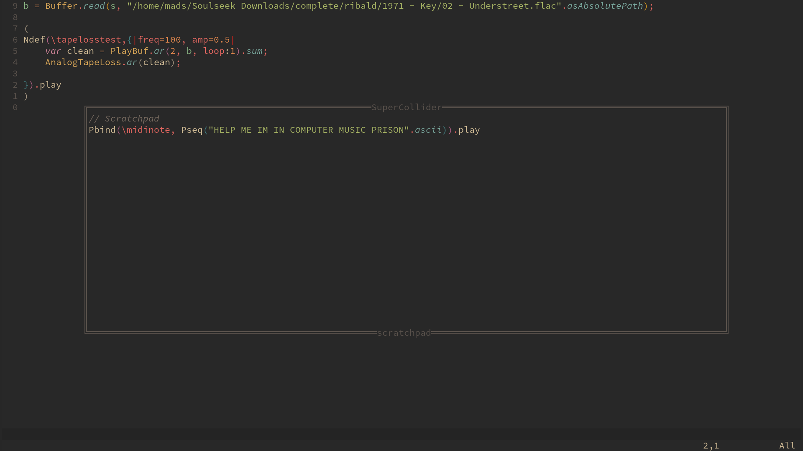

# sc-scratchpad.nvim
 

Quickly open a scratchpad buffer, write some code and execute the contents using SuperCollider. 

*sc-scratchpad* allows the user to quickly pop open a throwaway buffer for experimentation with sclang code. You can use this buffer as a scratchpad for messing around with the SuperCollider language, trying out methods or doing other small code experiments that you don't want to have inserted into your main code files.

## Installation

You need NVim >= 0.5 to use this plugin.

[This plugin uses nui.nvim](https://github.com/MunifTanjim/nui.nvim) for the UI and it needs to be installed along side this plugin as well as [scnvim](https://github.com/davidgranstrom/scnvim) for the SuperCollider stuff.

Using [vim-plugin](https://github.com/junegunn/vim-plug):

```vim
Plug 'MunifTanjim/nui.nvim'
Plug 'davidgranstrom/scnvim'
Plug 'madskjeldgaard/sc-scratchpad.nvim'
```

Using [packer.nvim](https://github.com/wbthomason/packer.nvim):

```lua
use {
	'madskjeldgaard/sc-scratchpad.nvim',
	requires = { 'MunifTanjim/nui.nvim', 'davidgranstrom/scnvim' }, 
	after = {'scnvim'},
	config = function()
		require"sc-scratchpad".setup({
			keymaps = {
				toggle = "<space>", -- Open/close buffer
				send = "<C-e>", -- Send and close
			},
			open_insertmode = true -- Open scratchpad buffer in insertmode
		})
end
}
```

## Usage

By default, pressing the space bar in a supercollider buffer will open up a temporary sc-scratchpad buffer. Put some code in and then press space or `C-e` to execute it. 

## Setup

```lua
require"sc-scratchpad".setup({
	keymaps = {
		toggle = "<space>", -- Open/close buffer
		send = "<C-e>", -- Send and close
	},
	border = "double", -- "double", "none", "rounded", "shadow", "single" or "solid"
	position = "50%",
	width = "50%",
	height = "50%",
	firstline = "// Scratchpad",
	open_insertmode = true, -- Open scratchpad buffer in insertmode
    close_on_execution = false -- Should the window automatically close on exec?
})
```
