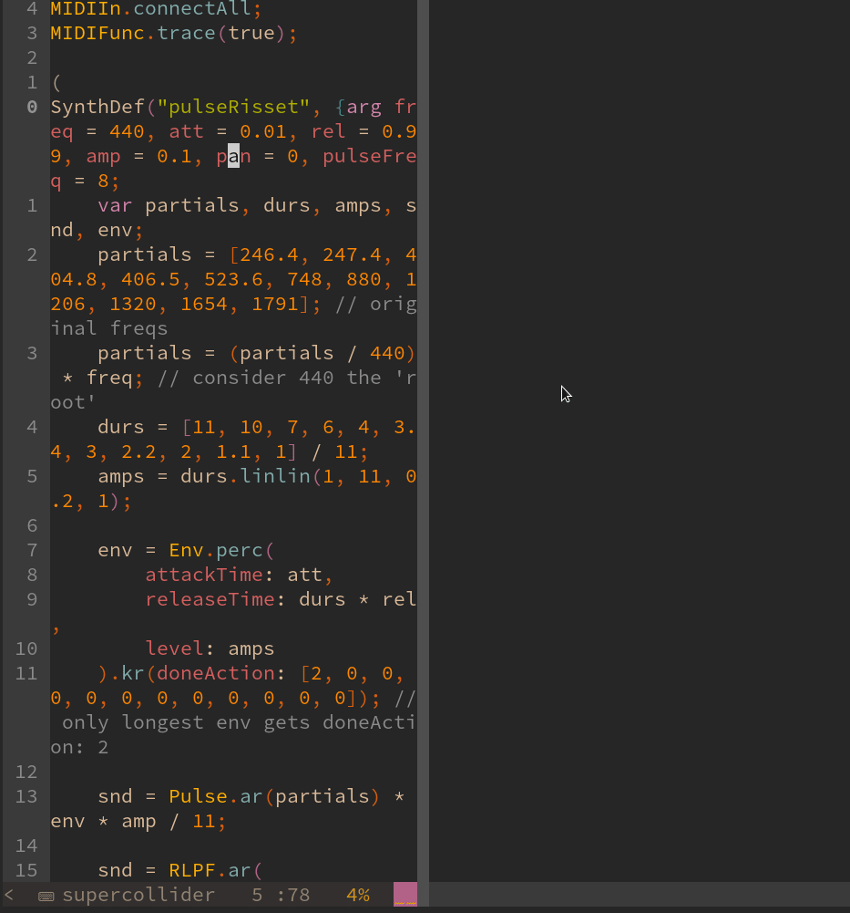

# sc-scratchpad.nvim
 

Is your SuperCollider code filled with things like `3.linexp(0,10,300.0,555.0)` and `1-0.5` and `~someCrap.class.postln` ?

Then this plugin is for you! 

*sc-scratchpad* allows the user to pop open a throwaway buffer, fill it with whatever code you want to execute and then execute and destroy it.

## Installation

You need NVim >= 0.5 to use this plugin.

[This plugin uses nui.nvim](https://github.com/MunifTanjim/nui.nvim) for the UI and it needs to be installed along side this plugin.

Using [vim-plugin](https://github.com/junegunn/vim-plug)

```vim
Plug 'MunifTanjim/nui.nvim'
Plug 'madskjeldgaard/sc-scratchpad.nvim'
```

Using [packer.nvim](https://github.com/wbthomason/packer.nvim)

```lua
use 'wbthomason/packer.nvim'
use 'MunifTanjim/nui.nvim'
```


## Usage

By default, pressing the space bar in a supercollider buffer will open up a temporary sc-scratchpad buffer. Put some code in and then press space or `C-e` to execute it. 

## Setup

```lua
require"sc-scratchpad".setup({
	keymaps = {
		toggle = "<space>",
		send = "<C-E>",
	},
	position = "50%",
	width = "50%",
	height = "50%",
})
```
